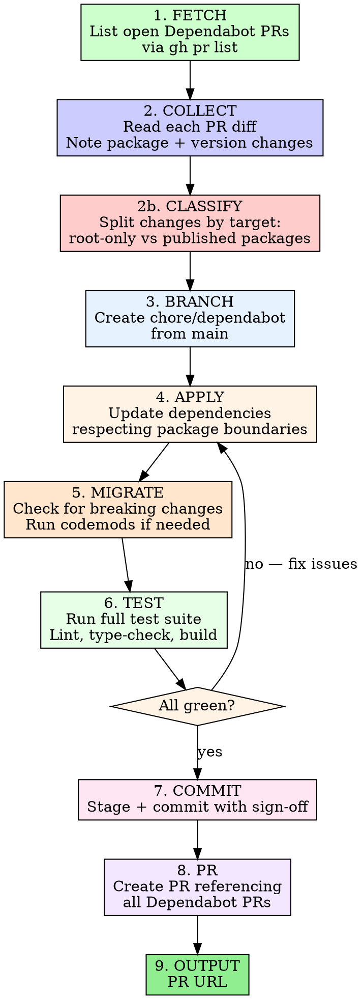

# Address Dependabot

Consolidate all open Dependabot pull requests into a single tested branch and PR.

## Invocation

```
/address-dependabot
```

## Process



## Published Package Boundary Rules

This repo contains `@datarecce/ui`, a **published npm package** consumed by external projects. Its `dependencies` field is a contract with consumers. This shapes how dependency updates are applied.

### The Three Zones

| Zone | File | Who sees it | Bump freely? |
|------|------|-------------|-------------|
| **Root app** | `js/package.json` | Monorepo only | Yes |
| **Published deps** | `js/packages/ui/package.json` `dependencies` | **npm consumers** | **No** |
| **Published devDeps** | `js/packages/ui/package.json` `devDependencies` | Monorepo only | Yes |
| **Storybook** | `js/packages/storybook/package.json` | Monorepo only | Yes |
| **Lockfile** | `js/pnpm-lock.yaml` | Monorepo only | Yes (auto) |

### When to bump `@datarecce/ui` dependencies

Only raise the minimum version floor in `@datarecce/ui`'s `dependencies` when:

1. **The code actually uses an API** introduced in the newer version
2. **A security fix** in the dependency is critical and consumers must have it
3. **A bug in the old version** causes `@datarecce/ui` to malfunction

Do **NOT** bump `@datarecce/ui` dependency floors just because Dependabot suggests it. Dependabot does not understand published package consumer impact.

### Example

Dependabot wants `@codemirror/state: ^6.5.0` raised to `^6.6.0`:

- **Root `js/package.json`**: Update to `^6.6.0` -- this controls what the monorepo installs
- **`js/packages/ui/package.json`**: Keep `^6.5.0` -- consumers on 6.5.x should not be forced to update unless our code requires 6.6 features

Reference: `js/packages/ui/DEPENDENCIES.md` for the full consumer dependency contract.

## Phase 1: Fetch Open Dependabot PRs

List all open PRs authored by Dependabot:

```bash
gh pr list --author "app/dependabot" --state open --json number,title,url,headRefName,body --limit 100
```

If no PRs found, report "No open Dependabot PRs" and stop.

Save the list -- you will need the PR numbers for the closing references in Phase 8.

## Phase 2: Collect and Collate Changes

For each Dependabot PR, extract the dependency update details:

```bash
gh pr diff <number> --name-only
gh pr view <number> --json body,title
```

Build a manifest of all required changes:
- **Package name** and **ecosystem** (npm, pip, GitHub Actions, Docker, etc.)
- **Current version** -> **Target version**
- **Files affected** (package.json, requirements.txt, pyproject.toml, Dockerfile, .github/workflows/*.yml, etc.)

Group updates by ecosystem for efficient batch processing.

### Phase 2b: Classify Changes by Target

For each npm package update, determine which zone it belongs to:

1. **Read `js/packages/ui/package.json`** to identify which packages are `@datarecce/ui` dependencies vs devDependencies
2. For each Dependabot-proposed change to `js/packages/ui/package.json` dependencies:
   - **Check if the version floor bump is required** (API change, security fix, bug fix)
   - If NOT required: mark as "root-only" -- apply to `js/package.json` and lockfile, skip `@datarecce/ui`
   - If required: mark as "all" -- apply everywhere
3. Changes to `js/packages/ui/package.json` devDependencies: apply freely
4. Changes to `js/packages/storybook/package.json`: apply freely
5. Changes to `js/package.json` (root): apply freely

**Output a classification table before proceeding to Phase 4:**

| Package | Target Version | @datarecce/ui dep? | Bump ui floor? | Reason |
|---------|---------------|-------------------|----------------|--------|
| next | 16.1.7 | No | N/A | Root-only |
| @codemirror/state | ^6.6.0 | Yes | No | No API requirement |
| some-pkg | ^2.0.0 | Yes | Yes | Security fix CVE-XXXX |

## Phase 3: Create Local Branch

```bash
git checkout main
git pull origin main
git checkout -b chore/dependabot
```

## Phase 4: Apply Dependency Updates

Apply updates grouped by ecosystem, **respecting the classification from Phase 2b**.

### npm / pnpm (package.json)

For packages classified as **root-only** (most `@datarecce/ui` deps):
```bash
# Update ONLY in root js/package.json
# Edit the version specifier in js/package.json
# Do NOT touch js/packages/ui/package.json dependencies
```

For packages classified as **all** (confirmed API/security requirement):
```bash
# Update in both root js/package.json AND js/packages/ui/package.json
```

For `@datarecce/ui` devDependencies and storybook packages:
```bash
# Update freely in their respective package.json files
```

After all edits, regenerate the lockfile:
```bash
pnpm --dir js install
```

### Python (requirements*.txt / pyproject.toml)
```bash
source .venv/bin/activate && which python
uv lock --upgrade-package <package>
# Or for pinned deps: edit pyproject.toml and run uv lock
```

### GitHub Actions (.github/workflows/*.yml)
Edit workflow files directly to update action versions (e.g., `actions/checkout@v4.2.0` -> `actions/checkout@v4.2.1`).

### Docker (Dockerfile)
Edit base image tags as specified by Dependabot.

### Other ecosystems
Read the Dependabot PR body for specific update instructions. Apply manually if no automated tooling fits.

**Important:** After applying all updates, verify lockfiles are consistent:
```bash
# For pnpm projects
pnpm --dir js install --frozen-lockfile || pnpm --dir js install
```

## Phase 5: Check for Breaking Changes and Migrations

For each major version bump:
1. Check the package's CHANGELOG or release notes (use `gh release list -R <owner>/<repo>` or WebFetch)
2. Search for migration guides
3. Look for deprecated API usage in the codebase:
   ```bash
   # Search for imports/usage of updated packages
   rg "<package-name>" --type-add 'src:*.{ts,tsx,js,jsx,py}' -t src
   ```
4. Apply any required codemods or manual migrations

If a migration is unclear or risky, **ask the user for clarification** before proceeding.

## Phase 6: Test Everything

Run the full quality gate for each ecosystem affected:

### Frontend (if npm/pnpm packages changed)
```bash
# Activate nave for Node.js
NAVE_DIR=~/.nave && NAVE_VER=$(cat js/.nvmrc) && \
  [ -d "$NAVE_DIR/installed/$NAVE_VER/bin" ] && \
  export PATH="$NAVE_DIR/installed/$NAVE_VER/bin:$PATH"

cd js && pnpm lint
cd js && pnpm type:check
cd js && pnpm test
cd js && pnpm run build
```

### Backend (if Python packages changed)
```bash
source .venv/bin/activate && which python
make format && make flake8 && make test
```

### Infrastructure (if CDK/Docker changed)
```bash
# Verify CDK synth still works
cd cdk && npx cdk synth --quiet
```

### CI workflows (if GitHub Actions changed)
Validate YAML syntax and review action version compatibility.

If tests fail:
1. Read the error carefully
2. Check if it's related to the dependency update
3. Fix the issue (update imports, API calls, config)
4. Re-run tests
5. If the fix is non-trivial, ask the user before proceeding

## Phase 7: Commit

Stage all changed files and commit:

```bash
git add <specific-files>
cat > /tmp/dependabot-commit-msg.txt << 'COMMIT_EOF'
chore(deps): consolidate dependabot updates

Updates:
- <package1>: v1.0.0 -> v2.0.0
- <package2>: v3.1.0 -> v3.2.0
...

@datarecce/ui dependency floors unchanged (consumer-facing).

Co-Authored-By: Claude <noreply@anthropic.com>
COMMIT_EOF
git commit -s -F /tmp/dependabot-commit-msg.txt
```

List every updated package and version range in the commit body. Note whether `@datarecce/ui` dependency floors were changed and why.

## Phase 8: Push and Create PR

```bash
git push -u origin chore/dependabot
```

Write the PR body to a temp file. **The PR body MUST include `Closes #<number>` for every Dependabot PR** so they auto-close when merged:

```bash
cat > /tmp/dependabot-pr-body.md << 'PR_EOF'
## Summary

Consolidates the following Dependabot PRs into a single tested update:

- Closes #<pr1> -- <title1>
- Closes #<pr2> -- <title2>
- Closes #<pr3> -- <title3>
...

### Changes

| Package | From | To | Ecosystem |
|---------|------|----|-----------|
| pkg1 | v1.0 | v2.0 | npm |
| pkg2 | v3.1 | v3.2 | pip |
...

### @datarecce/ui Impact

<State whether any @datarecce/ui dependency floors were changed.>
<If changed, explain why (API requirement, security fix).>
<If unchanged, state: "No consumer-facing dependency changes.">

## Test plan
- [x] All frontend tests pass
- [x] All backend tests pass
- [x] Lint passes
- [x] Type-check passes
- [x] Build succeeds
- [ ] Manual verification (if applicable)

Generated with [Claude Code](https://claude.ai/code)
PR_EOF

gh pr create --base main \
  --title "chore(deps): consolidate dependabot updates" \
  --body-file /tmp/dependabot-pr-body.md
```

## Phase 9: Output

Print the PR URL so the user can review it.

Summarize:
- Total number of Dependabot PRs addressed
- Packages updated (with version changes)
- **Whether `@datarecce/ui` consumer-facing dependencies were changed** (and why or why not)
- Any issues encountered or manual steps needed

## Iron Rules

| Rule | Why |
|------|-----|
| **Fetch PRs first.** Never guess which packages need updating. | Dependabot PRs are the source of truth. |
| **Classify before applying.** Determine root-only vs published for every npm change. | Blindly bumping `@datarecce/ui` floors breaks consumers. |
| **Never bump `@datarecce/ui` dep floors without justification.** | Its `dependencies` are a contract with npm consumers. |
| **Record all PR numbers.** Every Dependabot PR must appear in the closing references. | Missing a `Closes #N` means a stale PR lingers. |
| **Test before PR.** Full test suite must pass. | A broken consolidation PR defeats the purpose. |
| **Ask on major bumps.** If a major version has breaking changes you can't resolve, ask the user. | Silent breakage is worse than pausing. |
| **One branch, one PR.** All updates go in `chore/dependabot`, one PR. | The goal is consolidation, not more PRs. |
| **Temp file for PR body.** Use `--body-file`, never inline `--body`. | Special characters break shell escaping. |
| **Sign-off on commits.** Always `-s` flag (DCO required). | Repository policy. |
| **Specific git add.** Stage files by name, not `git add -A`. | Prevents accidental inclusions. |

## When Stuck

| Problem | Fix |
|---------|-----|
| Dependabot PR has merge conflicts | Ignore that PR's diff; apply the version update manually from the target version |
| Lockfile won't regenerate cleanly | Delete the lockfile, reinstall from scratch, verify tests pass |
| Major version bump breaks tests | Check migration guide, apply fixes, ask user if unclear |
| GitHub Actions version not found | Check the action's releases page for the correct tag |
| Mixed ecosystem updates conflict | Apply one ecosystem at a time, test between each |
| Unsure if `@datarecce/ui` floor bump is needed | Default to NOT bumping. Check DEPENDENCIES.md. Ask the user if genuinely unclear. |
