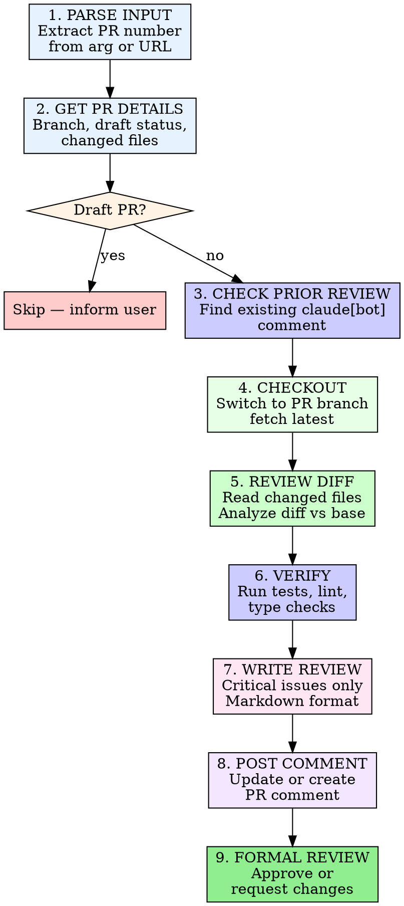

# Claude Code Review

Review a pull request for critical issues and post findings to GitHub.

## Invocation

```
/claude-code-review <PR number or URL>
```

## Process



### 1. Parse Input

Extract the PR number from the argument. Accept:
- Bare number: `123`
- URL: `https://github.com/owner/repo/pull/123`

```bash
# Get owner/repo from current repo
REPO=$(gh repo view --json nameWithOwner -q '.nameWithOwner')
```

### 2. Get PR Details

```bash
PR_DATA=$(gh api repos/{owner}/{repo}/pulls/{pr_number})
HEAD_REF=$(echo "$PR_DATA" | jq -r '.head.ref')
IS_DRAFT=$(echo "$PR_DATA" | jq -r '.draft')
BASE_REF=$(echo "$PR_DATA" | jq -r '.base.ref')
```

### 3. Skip Draft PRs

If `IS_DRAFT` is `true`, inform the user and stop. Do not review draft PRs.

### 4. Check for Prior Review

Look for an existing comment from `claude[bot]` on the PR:

```bash
COMMENT_ID=$(gh api repos/{owner}/{repo}/issues/{pr_number}/comments \
  --jq '[.[] | select(.user.login == "claude[bot]")] | first | .id // empty')
```

If found, read the prior review to understand what was previously flagged. New commits may address those findings.

### 5. Checkout PR Branch

```bash
git fetch origin "$HEAD_REF"
git checkout "$HEAD_REF"
```

### 6. Review the Diff

```bash
gh pr diff {pr_number}
```

Read all changed files in full context. Focus the review on:

| Category | What to look for |
|----------|-----------------|
| **Bugs** | Logic errors, off-by-one, null/undefined, race conditions |
| **Security** | Injection, auth bypass, secrets in code, OWASP top 10 |
| **Performance** | N+1 queries, missing indexes, unbounded loops, memory leaks |
| **Test gaps** | Untested edge cases, missing error path tests |
| **Correctness** | Does the code do what the PR description says? |

**Do NOT flag:**
- Style/formatting preferences (that's what linters are for)
- Minor naming suggestions
- "Consider" or "you might want to" suggestions — only flag real issues

### 7. Verify — Run Tests, Lint, and Type Checks

Run the project's verification commands to surface issues that static reading might miss. This strengthens the review with concrete evidence.

**Backend (Python):**
```bash
make test        # Unit tests
make flake8      # Lint
```

**Frontend (TypeScript):**
```bash
cd js && pnpm test          # Unit tests
cd js && pnpm lint          # Biome lint
cd js && pnpm type:check    # TypeScript type checking
```

Run whichever commands are relevant to the files changed in the PR. Include any failures or warnings as findings in the review — these are concrete evidence of issues, not speculation.

If tests or lint fail, note the specific failures in the review findings. Do NOT attempt to fix them — just report them.

### 8. Write the Review

Format the review in Markdown. Write to a temp file to avoid shell escaping issues.

**If this is an updated review** (prior comment found):
- Prefix with `## Updated Review`
- Acknowledge findings from the prior review that have been fixed
- Note any issues that remain unaddressed
- Add any new findings from new commits

**Structure:**

```markdown
## Code Review — PR #{pr_number}

### Summary
One-line verdict: what this PR does and overall assessment.

### Findings

#### [Critical/Warning] Issue Title
**File:** `path/to/file.ts:42`
**Issue:** Description of the problem
**Suggestion:** How to fix it

(repeat for each finding)

### Verdict
- Approved or Issues Found with sign-off emoji
```

Use `###` for each finding heading. Use Markdown section links for cross-references. Do **not** reference issues/PRs with bare `#123` syntax in the review body (it creates unwanted GitHub links).

```bash
cat > /tmp/review_body.md << 'REVIEW_EOF'
<your review content here>
REVIEW_EOF
```

### 9. Post the Review

**Update existing comment or create new one:**

```bash
# If prior comment exists:
gh api repos/{owner}/{repo}/issues/comments/{comment_id} \
  -X PATCH -f body="$(cat /tmp/review_body.md)"

# If no prior comment:
gh pr comment {pr_number} --body-file /tmp/review_body.md
```

**Submit formal GitHub review:**

```bash
# No critical issues:
gh pr review {pr_number} --approve \
  --body "Claude Code Review: No critical issues found."

# Critical issues found:
gh pr review {pr_number} --request-changes \
  --body "Claude Code Review: Critical issues found. See review comment for details."
```

## Known False Positives — Do NOT Flag

- **React 19 APIs:** This project may use React 19.x. The `<Activity>` component (`import { Activity } from "react"`) is a stable React 19 API. Do NOT flag `<Activity mode="visible">` or `<Activity mode="hidden">` as unknown components. Same for `useActionState`, `useFormStatus`, `use()`, etc.
- **Project conventions:** Respect patterns established in AGENTS.md and CLAUDE.md. If the codebase consistently uses a pattern, don't flag it.

## Iron Rules

- **No file modifications.** Do NOT modify, create, or delete any files. This is a review, not a fix. Running tests, lint, and type checks is encouraged — editing code is not.
- **Critical issues only.** Do not waste reviewer time with style nits or "consider" suggestions.
- **Temp file for posting.** Always write review body to `/tmp/review_body.md` and use `--body-file` or `cat`. Never inline long text in shell commands.
- **Every finding must cite a file and line.** No vague "somewhere in the code" findings.
- **Respect AGENTS.md and CLAUDE.md.** Use them for project-specific guidance on what matters.
- **Sign off clearly.** End with approved or issues-found verdict so the PR author knows the status at a glance.
