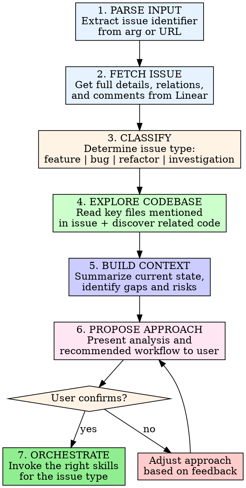

# Linear Deep Dive

Analyze a Linear issue end-to-end — understand it, explore the codebase, propose an approach, and orchestrate the right workflow to solve it.

## Invocation

```
/linear-deep-dive <issue ID, identifier, or URL>
```

Examples:
- `/linear-deep-dive DRC-2893`
- `/linear-deep-dive https://linear.app/recce/issue/DRC-2893/...`

## Process



---

### 1. Parse Input

Extract the Linear issue identifier from the argument. Accept:
- Identifier: `DRC-2893`
- URL: `https://linear.app/recce/issue/DRC-2893/refactor-eliminate-...`

For URLs, extract the identifier segment (e.g., `DRC-2893` from the path).

### 2. Fetch Issue

Use the Linear MCP server to retrieve the full issue with relations:

```
Tool: mcp__claude_ai_Linear__get_issue
  id: <identifier>
  includeRelations: true
```

Extract and note:
- **Title and description** — the core problem statement
- **Priority** — how urgent this is
- **Status** — current workflow state
- **Labels** — issue classification (Bug, Feature, Improvement, etc.)
- **Assignee** — who owns it
- **Relations** — blocking/blocked-by/related issues
- **Key files** — any file paths mentioned in the description
- **Git branch** — the `gitBranchName` field (use this for work)

Also fetch comments for additional context:

```
Tool: mcp__claude_ai_Linear__list_comments
  issueId: <issue UUID>
```

### 3. Classify the Issue

Determine the issue type from title, description, and labels. This drives which skills to invoke later.

| Classification | Signals | Primary Workflow |
|---------------|---------|-----------------|
| **Feature** | Label: Feature, "add", "new", "implement", "support" | brainstorming → writing-plans → executing-plans |
| **Bug** | Label: Bug, "fix", "broken", "regression", "error", stack traces | systematic-debugging → TDD |
| **Refactor** | Label: Improvement, "refactor", "eliminate", "simplify", "clean up" | writing-plans → TDD → executing-plans |
| **Investigation** | "investigate", "understand", "why does", "how does", question marks | codebase exploration → summary document |

If the classification is ambiguous, ask the user:

> This issue could be approached as a **refactor** or a **feature**. The description mentions eliminating a pattern (refactor) but also introduces new cache-patching behavior (feature). How would you like to approach it?

### 4. Explore Codebase

This is the core research phase. Use the Agent tool with `subagent_type: Explore` for broad discovery, and direct Read/Grep/Glob for targeted lookups.

**Step 4a — Read files mentioned in the issue:**

If the issue description references specific files (common in well-written issues), read them first. These are the author's pointers to the relevant code.

**Step 4b — Discover related code:**

Based on what you learn from the referenced files, explore outward:
- Grep for key function/variable names mentioned in the issue
- Find related test files for the affected code
- Check imports and callers of the affected modules
- Look for similar patterns elsewhere that might be affected

**Step 4c — Check related Linear issues:**

If the issue has relations (blocking, blocked-by, related), fetch those issues briefly to understand the broader context. Don't deep-dive them — just note how they connect.

**Step 4d — Check the git branch:**

If the issue has a `gitBranchName`, check its state:

```bash
git branch -a | grep "<branch-name>"
git log main..<branch-name> --oneline  # If branch exists: what's already done?
```

If the branch already has commits, read through them to understand work-in-progress.

### 5. Build Context

Synthesize everything into a structured analysis. Write this to a temp working document:

```bash
# Save analysis to gitignored docs directory
mkdir -p docs/plans
```

**Analysis document structure:**

```markdown
# Deep Dive: <ISSUE-ID> — <Title>

## Issue Summary
<1-3 sentence distillation of the problem/request>

## Classification
**Type:** <feature | bug | refactor | investigation>
**Priority:** <from Linear>
**Labels:** <from Linear>

## Current State
<What the code does today — based on codebase exploration>

## Key Files
| File | Role | Lines of Interest |
|------|------|-------------------|
| `path/to/file.ts` | Description | L42-87: relevant function |

## Related Issues
| Issue | Title | Relationship |
|-------|-------|-------------|
| DRC-XXXX | Title | blocks / related to |

## Risks and Open Questions
- <Risk or uncertainty that needs clarification>
- <Anything the issue description assumes but code doesn't confirm>

## Proposed Approach
<See Step 6>
```

### 6. Propose Approach

Based on the classification and codebase exploration, propose a concrete approach. Present this to the user **before** executing.

**The proposal must include:**

1. **Approach summary** — 2-3 sentences on what you'll do
2. **Classification and workflow** — which skills will be invoked and why
3. **Task breakdown** — high-level steps (not full plan yet — that's for writing-plans)
4. **Scope boundaries** — what's in scope and explicitly what's NOT
5. **Risks** — anything that might complicate the work
6. **Estimated complexity** — small (1-2 files), medium (3-5 files), large (6+ files)

**Format the proposal clearly:**

```markdown
## Proposed Approach for <ISSUE-ID>

**Classification:** Refactor
**Workflow:** writing-plans → TDD → executing-plans
**Complexity:** Medium (4 files)

### What I'll Do
<2-3 sentence summary>

### Steps
1. <High-level step>
2. <High-level step>
3. ...

### Scope
**In scope:** <what's included>
**Out of scope:** <what's explicitly excluded>

### Risks
- <Risk and mitigation>

### Ready to proceed?
I'll start by invoking **writing-plans** to create a detailed implementation plan.
```

**Wait for user confirmation before proceeding.**

### 7. Orchestrate — Invoke the Right Skills

Based on classification and user confirmation, invoke the appropriate skill chain. The skill invocations below are the **default workflows** — adjust based on the specific issue.

#### Feature Workflow

```
1. Invoke: superpowers:brainstorming
   - Feed it the issue summary and proposed approach
   - Let it explore alternatives and refine the design

2. Invoke: superpowers:writing-plans
   - Create detailed implementation plan from the brainstorming output
   - Plan includes exact file paths, code changes, and verification steps

3. Invoke: superpowers:executing-plans (or superpowers:subagent-driven-development)
   - Execute the plan with review checkpoints
```

#### Bug Workflow

```
1. Invoke: superpowers:systematic-debugging
   - Follow the four phases: investigate → analyze → hypothesize → implement
   - Use the issue description as the starting point for reproduction

2. Invoke: superpowers:test-driven-development
   - Write a failing test that reproduces the bug FIRST
   - Then implement the fix
   - Verify the test passes
```

#### Refactor Workflow

```
1. Invoke: superpowers:writing-plans
   - Create a detailed refactoring plan
   - Emphasize: preserve existing behavior, add tests for current behavior first

2. Invoke: superpowers:test-driven-development
   - For each refactoring step: verify existing tests pass, then refactor

3. Invoke: superpowers:executing-plans (or superpowers:subagent-driven-development)
   - Execute with frequent verification checkpoints
```

#### Investigation Workflow

```
1. Use Agent tool (subagent_type: Explore) for deep codebase analysis
2. Summarize findings in docs/summaries/<date>-<issue-id>-findings.md
3. Post findings back to the Linear issue as a comment (with user permission)
```

---

## Branch Management

Before starting any implementation work:

```bash
# Check if the issue's branch already exists
BRANCH="<gitBranchName from Linear>"
git fetch origin

# If branch exists remotely
git checkout "$BRANCH"

# If branch doesn't exist, create from main
git checkout main && git pull
git checkout -b "$BRANCH"
```

Always work on the issue's designated branch. Never implement directly on `main`.

---

## Handling Edge Cases

### Issue has blockers
If the issue is blocked by other issues (`blockedBy` relations), inform the user:

> This issue is blocked by **DRC-XXXX**: "<title>". Would you like to:
> 1. Work on the blocker first
> 2. Proceed anyway (the blocker may not actually prevent progress)
> 3. Skip this issue for now

### Issue is vague or underspecified
If the issue lacks sufficient detail to propose an approach:

> The issue description doesn't specify <missing detail>. Before I can propose an approach, I need to understand:
> - <Specific question>
> - <Specific question>

### Issue spans frontend and backend
For full-stack issues, note both sides in the analysis and propose whether to tackle them together or separately. Default to **backend first** (APIs and data models), then frontend.

### Issue already has work-in-progress
If the git branch has existing commits, analyze them:
- What's already been done?
- Does it align with the issue description?
- Should we build on it or take a different approach?

Present findings to the user before proposing next steps.

---

## Iron Rules

- **Always fetch the issue first.** Never propose an approach based on the title alone.
- **Always explore the codebase.** Never propose changes to code you haven't read.
- **Always confirm with the user.** Never start implementation without presenting the approach and getting approval.
- **Respect the skill chain.** Use brainstorming for features, systematic-debugging for bugs. Don't skip steps.
- **Stay in scope.** The issue defines the boundaries. Don't expand scope without discussing with the user.
- **Use the issue's git branch.** Always work on `gitBranchName` from Linear, never on `main`.
- **Save your analysis.** Write the deep-dive document to `docs/plans/` so it persists across sessions.
