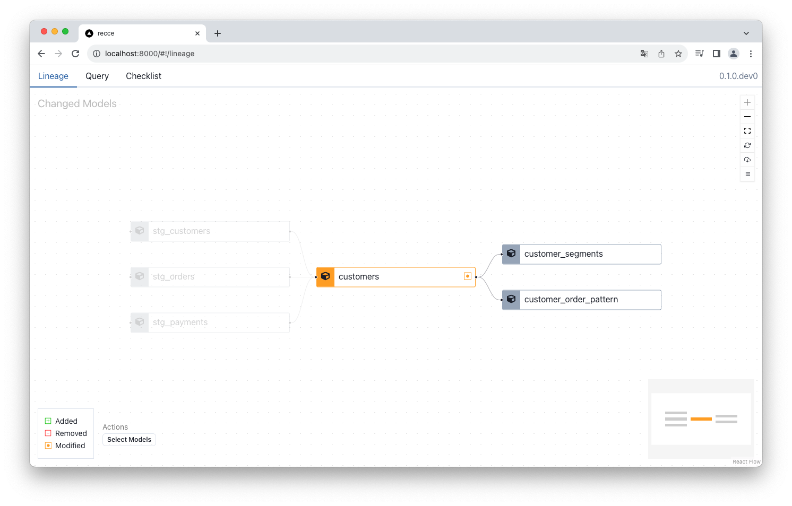
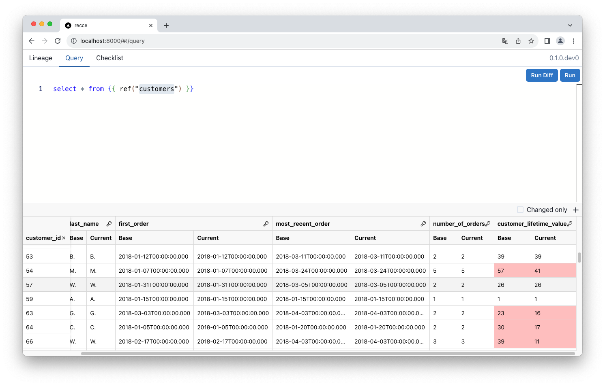
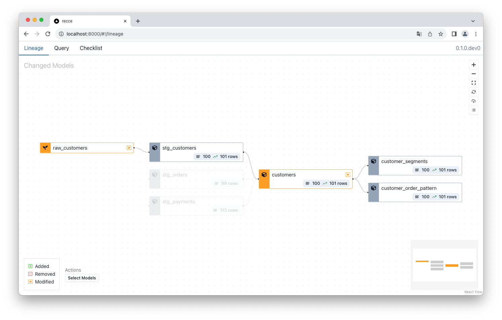
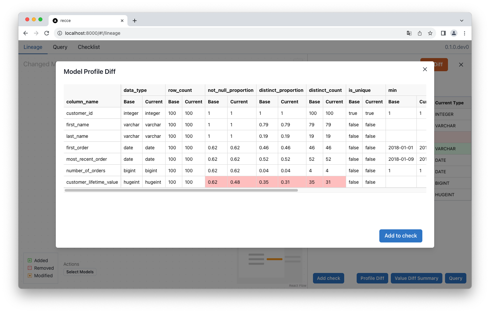
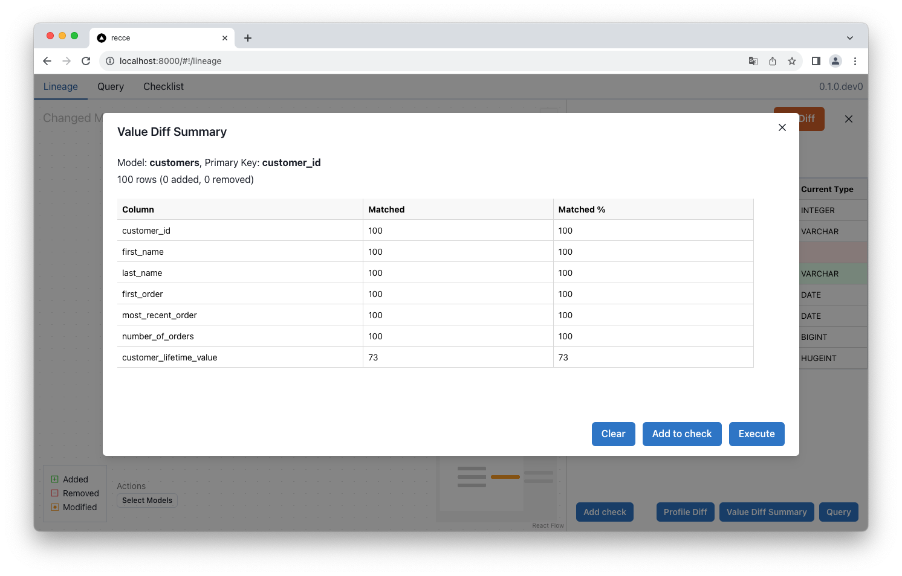
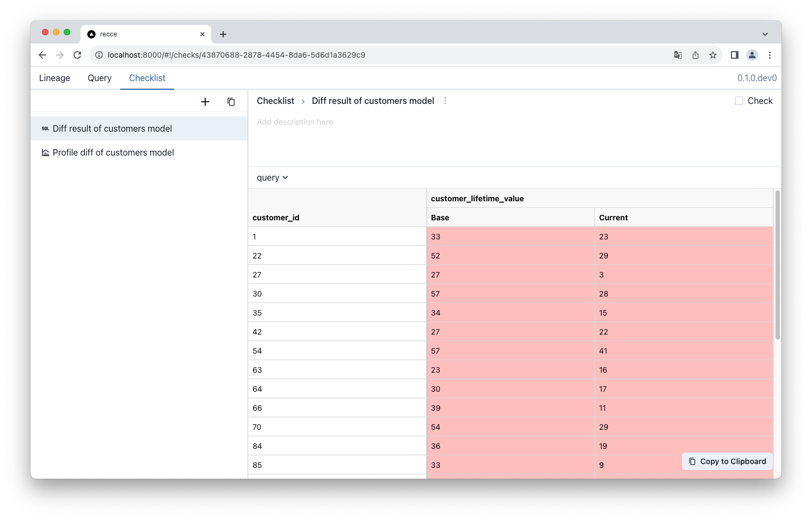

# Recce

[](https://pypi.org/project/recce/)
[](https://pypi.org/project/recce/)
[](https://pypi.org/project/recce/)
[](https://pypi.org/project/recce/#files)
[](https://github.com/DataRecce/recce/blob/main/LICENSE)

[](https://discord.com/invite/5zb2aK9KBV)

`Recce` is a PR review tool designed for dbt projects. It facilitates the comparison of results between two environments, such as development and production, and helps in identifying any differences.

## Features

- **[Lineage diff](#lineage-diff)**
- **[Schema diff](#schema-diff)**
- **[Row count diff](#row-count-diff)**
- **[Ad-Hoc Query and Query Diff](#ad-hoc-query-and-query-diff)**
- **[Profile Diff](#profile-diff)**
- **[Value Diff](#value-diff)**
- **[Checklist](#checklist)**

## Use cases

Recce is primarily designed for PR Review purposes. However, it can be expanded to the following use cases:

1. During development, we can verify new results by contrasting them with those from production prior to pushing the changes.
2. While reviewing PR, you can grasp the extent of the changes and their impact before merging.
3. For troubleshooting, you can execute ad-hoc diff queries to pinpoint the root causes.

# Usage

## Prerequisites

You have to have at least two [environments](https://docs.getdbt.com/docs/core/dbt-core-environments) in your dbt project. For example, one is for development and another is for production. You can prepare two targets with separate [schemas](https://docs.getdbt.com/docs/core/connect-data-platform/connection-profiles#understanding-target-schemas) in your dbt profile. Here is `profiles.yml` example

```
jaffle_shop:
  target: dev
  outputs:
    dev:
      type: duckdb
      path: jaffle_shop.duckdb
      schema: dev
    prod:
      type: duckdb
      path: jaffle_shop.duckdb
      schema: main
```

## Getting Started

[5 minutes walkthrough by jaffle shop example](./docs/get-started-jaffle-shop.md)

1. Installation

   ```shell
   pip install recce
   ```

1. Go to your dbt project
   ```shell
   cd your-dbt-project/
   ```
1. Prepare artifacts for base environment in `target-base/` folder

   ```shell
   git checkout main

   # Generate artifacts for base environment to 'target-base'
   dbt docs generate --target prod --target-path target-base/
   ```

1. Prepare artifacts for current working environment

   ```shell
   git checkout feature/my-awesome-feature

   # Run dbt and generate artifacts for current working environments
   dbt run
   dbt docs generate
   ```

1. Run the recce server.

   ```shell
   recce server

   # or with persistent state
   # recce server issue-123.json
   ```

   Recce would diff environments between `target/` and `target-base/`

Recce use dbt [artifacts](https://docs.getdbt.com/reference/artifacts/dbt-artifacts), which is generated when every invocation. You can find these files in the `target/` folder.

| artifacts     | dbt command                        |
| ------------- | ---------------------------------- |
| manifest.json | `dbt docs generate`, `dbt run`, .. |
| catalog.json  | `dbt docs generate`                |

> [!TIP]
> The regeneration of the `catalog.json` file is not required after every `dbt run`. it is only required to regenerate this file when models or columns are added or updated.

## Lineage Diff



## Ad-Hoc Query and Query Diff



You can use any dbt macros installed in your project.

```jinja
select * from {{ ref("mymodel") }}
```

In the query diff, which involves comparing the results from two different environments, the browser is required to pull all result data to the client side. Consequently, minimizing the data volume in the query results is essential for efficiency and performance.

> [!TIP]
> Hotkeys
> Cmd + Enter: Run query
> Cmd + Shift + Enter: Run query diff

## Schema diff


To use schema diff, make sure that both environments have `catalog.json.`

## Row count diff



## Profile diff



Profile diff uses the `get_profile` from [dbt_profiler](https://hub.getdbt.com/data-mie/dbt_profiler/latest/). Make sure that this package is installed in your project.

```
packages:
  - package: data-mie/dbt_profiler
    version: <version>
```

Please reference [dbt-profiler] to understand the definition of each profiling stats.

## Value diff



1. **Added**: New added PKs.
2. **Removed**: Removed PKs.
3. **Matched**: For a column, the count of matched value of common PKs.
4. **Matched %**: For a column, the ratio of matched over common PKs.

_PK: Primary key_

Value diff uses the `compare_column_values` from [audit-helper](https://hub.getdbt.com/dbt-labs/audit_helper/latest/). Make sure that this package is installed in your project.

```
packages:
  - package: dbt-labs/audit_helper
    version: <version>
```

Value diff requires to select a column as private key. The `catalog.json` is required to list the available columns.

## Checklist



When you feel that your query is worth recording, you can add it to the checklist and name the title and leave a description. This is very helpful for subsequent posting in PR comments.

# Q&A

### Q: How `recce` connect to my data warehouse? Does recce support my data warehouse?

`recce` use the [dbt adapter](https://docs.getdbt.com/docs/connect-adapters) to connect to your warehouse. So it should work for your data warehouse.

### Q: What credential does `recce` connect to the two environments?

Recce uses the same target in the profile to connect your warehouse. If you use the default target `dev`, it uses the credentials to connect to both environments. So please make sure that the credential can access both environments.
