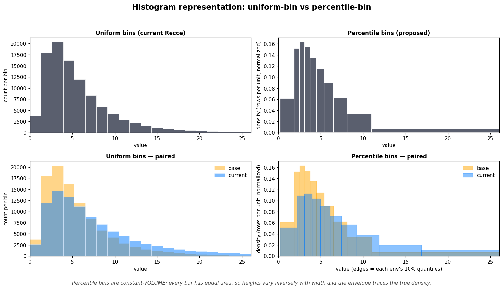

# DRC-3389 — Paired Histogram data-pull strategy

**Goal:** make paired histograms interactive when a user clicks a node in
the lineage view. The data-pull pipeline today (PR #1380) takes ~170s on
Snowflake for a 96-column model — that's "the user gave up" territory, not
interactive. This doc records every approach we measured, the verdict on
each, and what composes well.

A "cold" measurement is the first time a model is opened in a session; a
"warm" one is the same model on a subsequent visit. Cold and warm are
different UX problems — both have to work — but the data-pull pipeline
alone cannot make cold sub-second. Caching + pre-warming sit on top.

## TL;DR

Three named compositions used throughout this doc:

- **`stack`** = `cap_degenerate` + bernoulli `sample(K=10K)` materialized
  + `parallel(N)`. The three "different bottleneck, different lever"
  optimizations layered.
- **`stack_approx`** = `stack` + batched `approx_count_distinct` probe
  (replaces 96 per-column probes with one HLL query). Same chart format
  as today.
- **`approx_all`** = batched HLL probe + `APPROX_PERCENTILE` for
  histograms + `APPROX_TOP_K` for topks. No sampling, no CTAS, **6 SQL
  queries total**. Requires a frontend chart change (quantile-binned
  histograms — see B4) but lands at the lowest measured Snowflake wall.

**Recommended (per-pull):** `approx_all`. It's the fastest measured
Snowflake composition, has the simplest implementation (6 queries, no
CTAS, no sample lifecycle), and the chart-format change it requires
(quantile-binned histograms with constant-area bars) is genuinely a
*better* visualization of distributional shift — see B4 for the worked
visual. `stack_approx` remains the fallback if the chart change is
ever blocked.

Both compose with the architectural caching + pre-warming layer
(section C) for real interactivity — `approx_all` alone gets the cold
Snowflake floor to ~12s; the rest of the way to "click → chart appears"
is the caching layer.

Headline measurements (1M rows × 96 cols, both adapters, full page):

| Adapter | Baseline | Best per-pull | Speedup |
|---------|---------:|---------------:|--------:|
| DuckDB    | 38.7s | 1.23s (batched CTE) | **31.5×** |
| Snowflake | 170s  | **12.1s (approx_all)** | **~14×** |

Even with the best per-pull strategy, Snowflake cold-clicks are ~17s for a
full page and ~9s for a 15-column viewport. The path to "click → chart
appears now" is **caching for repeat visits + pre-warming for first
visits** — see section C.

## How we tested

- **Fixture:** synthetic `wide_synth` table, 1M rows × 96 columns. Type
  mix: 50 continuous numerics → histogram; 20 low-card strings + 10 high-
  card strings + 5 booleans + 5 UUIDs → topk; 5 timestamps + 1 BIGINT
  row_id → histogram. Two environments (`base`, `current`) with a 5% drift
  on a few columns so paired charts have actual signal.
- **Adapters:** dbt-duckdb 1.8.4 in-process, dbt-snowflake 1.8.4 against
  LOAD_WH = X-Small.
- **Harness:** `scripts/bench.py` (per-strategy runner with phase timings),
  `scripts/compare_accuracy.py` (paired-divergence L1 vs baseline),
  `scripts/variance_sweep.py` (cross-rerun chart noise). Strategies are
  monkey-patches over the unmodified `ProfileDistributionTask` from PR #1380.

The fixture is intentionally pessimistic — 96 columns is on the wide end
of realistic dbt models, the type mix forces every code path, and the
UUID columns surface the worst topk failure mode.

---

# Approaches by category

The data-pull cost has three independent levers. Each category contains
the approaches that pull one of these levers.

| Lever | Why it matters |
|-------|----------------|
| **Reduce data scanned per query** | Less I/O, faster per-query wall on scan-bound adapters (DuckDB) |
| **Reduce query count** | Round-trip cost dominates on networked adapters (Snowflake, BigQuery, etc.) |
| **Reduce time-to-first-result** | Even an "instant" backend can't beat a populated cache; "cold" is the architectural problem |

## A. Reduce data scanned per query

### A1. Bernoulli sampling — KEEP

Materialize `<model>__sample` once per environment via a CTAS
(`CREATE TABLE … AS SELECT …`) with the adapter's sample clause:
`USING SAMPLE K ROWS` on DuckDB, `SAMPLE (K ROWS)` on Snowflake. Run
topk / histogram counts on the sample; keep probe + bounds on the full
table.

**Why K=10K:** the wall-time curve is asymptotic — going from K=50K to
K=5K saves only ~1s on DuckDB. K=10K is the rightmost knee where
accuracy stays sub-perceptible.

| DuckDB sample K | Wall | Speedup | Histogram paired_l1 (avg/max) |
|----------------:|-----:|--------:|------------------------------:|
| 50 000          | 4.58s | 8.5× | 0.018 / 0.031 |
| **10 000**      | **3.26s** | **11.9×** | **0.044 / 0.067** |
| 5 000           | 3.03s | 12.8× | 0.062 / 0.105 |

A typical bar height moves ~0.2 percentage points across reruns at K=10K.
Below human perception. K=5K starts producing visible bin-level drift.

**Materialized beats inline.** A subquery `(select * from rel using sample
N rows) _s` rendered inline in every query is **3.8× slower** on DuckDB
(14.4s vs 3.8s, with 90× more wall-time variance) and **slightly worse
than baseline** on Snowflake (subquery wrapping kills predicate pushdown).
Materialization amortizes the sample-build cost across the 344 downstream
queries.

The reason materialization wins is speed + wall-time consistency, NOT
"stable charts across reruns." Both materialized and inline re-randomize
on each run; measured cross-run chart variance is essentially identical
between them (~0.002 std on per-bin proportions).

### A2. Block / system sampling — DISQUALIFIED

Both adapters offer `TABLESAMPLE SYSTEM` / `SAMPLE BLOCK (P)`, which reads
whole micro-partitions instead of scanning. Much faster on large tables.

We tested it on the fixture's `row_id` column — a perfectly monotonic
BIGINT that is **identical between base and current** (baseline confirms
every bin at 5.6% on both sides).

| Variant on `row_id` (1M rows, 18 bins)  | base_total | curr_total | shape |
|-----------------------------------------|-----------:|-----------:|-------|
| Baseline (full)                         | 1 000 000  | 1 000 000  | every bin 5.6%, base = curr |
| Bernoulli K=10K                         | 10 000     | 10 000     | every bin 5.0–6.1%, base ≈ curr |
| **Block ~1% (system)**                  | **10 240** | **4 096**  | **base: 5 spikes at 20%; curr: 2 spikes at 50%; near-disjoint** |

Block sampling reports **massive fake divergence** (max `paired_delta_l1
= 1.60` vs bernoulli's 0.07) on a column where the truth is identical.
The two samples landed on different micro-partitions; on a monotonic
column that translates to different value ranges, which the paired
histogram faithfully renders as "these distributions are wildly different."

A tool whose purpose is showing real diffs cannot fabricate fake ones.
Block sampling is not viable as a default — arguably not even as opt-in
without a prominent warning. **Bernoulli is the only correct method.**

### A3. Skip degenerate columns (`cap_degenerate`) — KEEP

When `distinct_count >= row_count - 1` (effectively unique per row), the
top-K is meaningless — every value has count 1. Emit an explicit empty
slot instead of running the expensive paired GROUP BY.

The `distinct_count` itself can come from an exact `count(distinct col)`
or from a much cheaper `approx_count_distinct(col)` — see [B3](#b3-batched-approx-count-distinct-probe--keep).
At HLL's ~1–2% error rate, the degeneracy threshold becomes
`approx_count >= 0.95 * row_count` and still cleanly catches UUIDs.

| DuckDB cap_threshold | Wall | Skipped | Notes |
|---------------------:|-----:|--------:|-------|
| **default** (row_count − 1) | 3.76s | 5 (UUIDs only) | identical-to-baseline accuracy on remaining cols |
| 1 000 | 3.44s | 5 (UUIDs only) | same — nothing in 1K–RC range to skip |
| 500   | 3.24s | 15 (UUIDs + all highcard_str) | small extra savings; hides 10 informative columns |
| 100   | 3.27s | 15 (same) | floor |
| 10    | 2.93s | 35 (UUIDs + highcard + lowcard) | too aggressive — blanks informative low-card data |

**Keep the default at `distinct >= row_count - 1`.** Lower thresholds
trade coverage for marginal extra speedup. The `paired_delta_l1` metric
underreports the cost because skipped columns drop out of the comparison;
the real failure mode is coverage loss on columns whose top-K *is*
informative.

A smarter post-hoc filter ("skip if no single value dominates") could
preserve coverage by only blanking columns whose topk would have been
uniform anyway. Not measured. Doesn't help wall time, only chart quality.

## B. Reduce query count

### B1. Parallel per-column (threadpool) — KEEP

Run the per-column dispatch loop on a thread pool. Each worker uses its
own `dbt_adapter.connection_named` to avoid stepping on shared cursor
state. Effective concurrency is bounded by the dbt profile's `threads`
setting (4 on our Snowflake profile).

- DuckDB: 1.15× (negligible — single-process saturates on disk/CPU)
- Snowflake: 2.2× (meaningful — independent round-trips parallelize cleanly)

The DuckDB result calibrates expectations: this lever is for
round-trip-dominated adapters. Bumping the dbt `threads` setting on
Snowflake would likely lift this further.

### B2. Batched CTE per kind — DuckDB winner, Snowflake wash

Collapse N per-column queries into 6 total: schema introspection,
batched distinct probe, batched bounds, batched topk (UNION ALL with
window-trimming), batched histogram. Same accuracy as baseline since
no sampling is involved.

| Adapter | Batched | vs best non-batched |
|---------|--------:|-------------------:|
| DuckDB    | **1.23s (31.5×)** | 1.9× faster than `stack` (defined in TL;DR) |
| Snowflake | 16.36s (2.19×) | parity with parallel |

Why the asymmetry: each batched query gets bigger (e.g. topk's UNION ALL
of 40 sub-aggregations). On DuckDB that's fine — it shares the table
scan across all aggregates. On Snowflake each big query takes ~1.85s
(vs 0.27s simple), eating most of the round-trip savings.

**Implementation cost:** denser SQL, more edge cases up front
(per-column casts to varchar for the topk union, per-column null-presence
branches for added/removed cols, adapter-portability landmines like
`count(*) FILTER (where …)` not existing on Snowflake — use `count_if`,
`epoch()` vs `date_part(epoch_second, …)`).

**When to ship this:** if DuckDB-local performance matters specifically
(say, recce running against a local dbt project for fast feedback).
For Snowflake-first deployments, the stacked alternative wins with much
less code change.

### B3. Batched approx-count-distinct probe — KEEP

The per-column probe phase (one `count(distinct col)` per column) was
not free: ~3% of DuckDB wall but **~28% of Snowflake SQL time**. Replace
the 96 per-column probes with one batched `approx_count_distinct` query
across all columns.

| Adapter | Per-col exact probe | Batched exact | Batched APPROX |
|---------|--------------------:|-------------:|---------------:|
| DuckDB    | 0.43s | 0.55s | **0.04s** |
| Snowflake | ~15s (parallel 4)  | 9.17s | **1.39s** |

HyperLogLog accuracy is fine for our decisions: ~1–2% error at 1M
cardinality (cap_degenerate's threshold is `>= 0.95 * row_count` to absorb
that) and essentially perfect at small cardinalities (the low-card
dispatch threshold of 30).

End-to-end impact on Snowflake stack: stack 23.2s → stack_approx 17.6s
(saves ~6s, ~24% improvement).

### B4. Quantile-binned histograms via `APPROX_PERCENTILE` — KEEP (with chart change)

Replace the histogram pipeline (bounds query + per-env binning query)
with **one batched approximate-percentile query per env**. Compute the
column's 0th, 5th, …, 95th, 100th percentile values via Snowflake's
`APPROX_PERCENTILE_ACCUMULATE` (build one t-digest sketch per column in
a single scan) + `APPROX_PERCENTILE_ESTIMATE` (extract many quantile
values from each sketch). DuckDB's equivalent: `approx_quantile(col,
[0.05, 0.10, …, 0.95])` in one call per column.

Standalone timings:

| Adapter | Mode | Time | Note |
|---------|------|-----:|------|
| DuckDB    | batched `approx_quantile`, 51 cols × 19 pcts | **0.37s** | One scan, many sketches |
| Snowflake | flat `APPROX_PERCENTILE`, 51 cols × 19 calls | 5.59s | Planner shares scan |
| Snowflake | state-based `_ACCUMULATE`/`_ESTIMATE` | **3.29s** | 1 sketch per col, 19 estimates each |

**Chart implication: this is a frontend change.** The chart format
inverts:

- **Today (uniform bins, varying heights):** 20 bins, all the same
  width, bar heights = row counts per bin. Divergence between base and
  current shows as height differences.
- **Quantile bins (varying widths, varying heights):** N bins, each
  containing 1/N of rows by construction. Bar height = density =
  `(1/N) / bin_width`, so narrow bins (dense regions of the
  distribution) are tall and wide bins (sparse tails) are short. The
  envelope of bar heights now traces the actual probability density
  shape of the column.

The paired version overlays each env's quantile-binned density. The
divergence shows up as **shape shifts in the density envelope** — a peak
appearing in a different place, a longer or shorter tail, a wider or
narrower body. Side-by-side, the reading is "where did the data
*redistribute*", which is the actual information of interest.

Worked visual comparison on a log-normal pair (base shifted from
current, similar to a real ETL change):



How to read the 2×2:

- **Top-left** — classic uniform-bin histogram. 20 fixed-width bins, bar
  heights = row counts. The log-normal's right-skewed shape is visible.
- **Top-right** — same data, percentile bins. 10 bins each holding 10%
  of rows; bars are constant-area (narrow→tall, wide→short), so heights
  read as density and the envelope traces the actual probability curve.
- **Bottom-left** — paired uniform. Same x-axis, base (orange) and
  current (blue) overlaid. Divergence shows in **bar-height differences
  in fixed x-slots**: orange peaks higher near x≈3, blue dominates the
  right tail.
- **Bottom-right** — paired percentile. Each env has its own quantile
  edges. Divergence shows as a **shape shift in the density envelope**:
  orange's peak is taller and to the left, blue's peak is shorter and
  pushed right, and blue's tail bars sit visibly higher than orange's.

The trap to avoid: constant-height percentile bars (without the
constant-area normalization) misrepresent the data, because a wider bin
looks more "important" than a narrow one when it's actually just covering
sparser territory. The density convention is the readable version.

### B5. `APPROX_TOP_K` for topk columns — KEEP (combine with B4)

Snowflake exposes `APPROX_TOP_K(col, k)` (Space-Saving sketch), DuckDB
has the equivalent. One batched query per env returns the top-K values
+ approximate counts for every topk-eligible column.

Snowflake: `APPROX_TOP_K` over 40 cols at k=12 = **1.26s** in one query.

This replaces the entire topk path — both base and current's expensive
paired GROUP BY + FULL OUTER JOIN, and (if combined with B4) the sample
materialization since the sketch streams over the full table.

### Putting B3 + B4 + B5 together: `approx_all`

Compose all three approximate-aggregate strategies into one composition.
Six SQL queries total regardless of column count: schema introspection
(free) + HLL probe + APPROX_PERCENTILE × 2 envs + APPROX_TOP_K × 2 envs.

Measurements at 1M × 96 cols on Snowflake X-Small:

| Variant | Wall | Notes |
|---------|-----:|-------|
| approx_all, 21 percentiles, sequential phases | 24.1s | All five SQL ops serialized |
| approx_all, 21 pcts, 2-way per-env parallelism | 16.95s | Percentile per-env, topk per-env in parallel |
| approx_all, 21 pcts, **5-way fully parallel** | **13.88s** | All 5 SQL ops kicked off concurrently |
| approx_all, **11 pcts**, 5-way parallel | **12.08s** | Coarser histograms, same 5-way fan-out |

Effective concurrency on the 5-way version is ~3.7× (SQL time / wall),
fully saturating LOAD_WH's threads. Reducing percentile count from 21 to
11 saves another ~2s by trimming per-query CPU. Diminishing returns
below ~10 percentiles.

The honest interpretation: approx_all is the new floor on Snowflake
per-pull. But like every other strategy, it caps at the warehouse
thread count. The X-Small warehouse can't deliver sub-10s on a
96-column table without architectural changes (caching, pre-warming).

## C. Reduce time-to-first-result (architectural)

These don't make the data-pull pipeline faster. They change *when* it
runs and *what's already done by the time the user looks.*

### C1. Viewport-only progressive rendering

The schema view shows ~15 columns at a time. The data-pull cost of those
15 columns is ~5s of SQL once sample + probe are in place; the rest
(~4s on Snowflake) is fixed startup.

Measured viewport: 15 cols, Snowflake, stack_approx = **9.35s cold**.

Breakdown:
- Sample CTAS (×2 envs, parallel): ~2s
- Batched approx probe (all 96 cols): ~1.5s
- 15 cols × topk/histogram queries, parallel 4: ~5s

Per-column amortized: ~180ms with parallelism. The first 15 cols absorb
all the fixed startup; each additional column thereafter is ~100ms.

The win is perceived latency: with progressive rendering the page paints
in <100ms (schema-only, manifest-derivable), distributions stream in as
they finish, and the user is engaged with column names and types while
the data fills in.

### C2. Pre-warming triggered by user intent

Three independent pre-warmable phases — each runs in parallel with the
others:

| Phase                              | Cost | Needs |
|------------------------------------|-----:|-------|
| Sample CTAS (both envs)            | ~2s  | Model name |
| Batched approx probe               | ~1.5s | Model name |
| Distribution queries for 15 cols   | ~5s  | Sample + probe |

Trigger hierarchy (weakest to strongest signal):

| Trigger | Safe to warm | Risk |
|---------|--------------|------|
| Recce server starts | Manifest-only (already done) | None |
| Lineage view opens | Pre-warm changed models in the diff (bounded ≤2 concurrent) | Compute on never-clicked models |
| Node hover (debounced ≥500ms) | Sample CTAS for that model | Hover-grazing burns warehouse |
| Node click in lineage | Sample + probe in parallel | Low — clicks are intentional |
| Schema view opens | Fire 15-col distribution queries | None — should be warm |
| Scroll | Fire queries for newly-visible cols | None |

**Highest-leverage trigger: node click in lineage.** Strong intent
signal, no speculative spend, ~3–4s of warming before the user navigates
into the schema view.

**Skip for v1:** hover-warming (grazing risk too high without telemetry),
speculative full-project pre-compute (cost dominates benefit).

### C3. Distribution payload cache

Cache the final distribution JSON keyed by `(model, base_version,
curr_version)`. Repeat visits to the same model — same session OR next
session — become a hash lookup. Sub-100ms regardless of column count.

Snowflake exposes `last_altered` on `SHOW TABLES` for version detection;
DuckDB needs something coarser (file mtime, count + max(updated_at)).
Hash both manifest content AND table state; cache keys that miss either
will show stale charts.

This is the dominant lever for "Recce feels slow" complaints, since most
user activity is revisiting nodes they've already looked at.

### C4. Cancellation policy

If the user clicks node A, kicks off warming, then clicks node B before
A's schema view loads — do we cancel A or finish it?

**Let A finish, lower priority.** A's probes and sample are useful work;
canceling means A's eventual revisit pays again. For v1, "no cancellation;
bounded concurrency means a fast-clicking user just queues" is the simple
correct behavior.

---

# Putting it together

Single-strategy comparison, 1M × 96 cols on both adapters:

| Strategy                          | DuckDB wall | DuckDB speedup | Snowflake wall | Snowflake speedup | Chart format |
|-----------------------------------|------------:|---------------:|---------------:|------------------:|--------------|
| baseline                          | 38.73s | 1.00× | 170.27s | 1.00× | today |
| parallel (8)                      | 33.57s | 1.15× | (~78s extrapolated) | ~2.2× | today |
| sample (bernoulli K=10K)          | 3.26s | 11.9× | — | — | today |
| cap_degenerate                    | 3.76s | 10.3× | — | — | today |
| stack (cap + sample + parallel)   | 2.32s | 16.7× | 23.19s | 7.34× | today |
| **stack_approx** (+ batched probe)| — | — | **17.63s** | **9.66×** | today |
| batched CTE                       | **1.23s** | **31.5×** | 16.36s | 2.19× | today |
| **approx_all** (HLL + percentile + top_k) | — | — | **12.08s** | **~14×** | **new (quantile-binned)** |

Recommendation depends on whether shipping the new chart format is on the
table:

- **Today's chart format only**: `stack_approx` (Snowflake) / `stack` or
  `batched CTE` (DuckDB). Lowest-risk patches over the per-column task.
- **Chart change OK**: `approx_all`. Fastest measured Snowflake per-pull;
  simpler implementation (6 queries, no CTAS, no sample lifecycle);
  approximate everywhere, so the accuracy story is uniform.

Both compose with the caching + pre-warming layer in section C.

Viewport-only is where "interactive" actually lives:

| Scenario | Snowflake time | Notes |
|----------|---------------:|-------|
| Cold first-click, full page (96 cols), stack_approx | ~17s | Today's chart format |
| Cold first-click, full page (96 cols), approx_all   | ~12s | New chart format |
| Cold first-click, 15-col viewport | ~9s | Sample + probe + 15 cols (stack_approx) |
| Warm (sample + probe cached), 15 cols | ~5s | Just distribution queries |
| Cache hit (`model, base_v, curr_v`) | <100ms | Hash lookup, no SQL |

The first row is what we can deliver from the data-pull pipeline alone.
The rest require the cache + pre-warming layer.

---

# Adapter compatibility — a real tradeoff

`approx_all` requires the engine to support both `APPROX_PERCENTILE`-style
and `APPROX_TOP_K`-style sketch aggregations. This is the load-bearing
caveat on the recommendation, because not every adapter Recce might
target has both. Coverage at 2026-05-20:

| Engine | Approx percentile | Approx top-K | `approx_all` viable? |
|--------|-------------------|--------------|----------------------|
| Snowflake | ✅ `APPROX_PERCENTILE` (t-digest) | ✅ `APPROX_TOP_K` (Space-Saving) | ✅ yes |
| BigQuery | ✅ `APPROX_QUANTILES` | ✅ `APPROX_TOP_COUNT` | ✅ yes |
| DuckDB | ✅ `approx_quantile` | ✅ `approx_top_k` | ✅ yes |
| Databricks / Spark | ✅ `approx_percentile` | ✅ `approx_top_k` (3.5+) | ✅ yes |
| Athena / Trino / Presto | ✅ `approx_percentile` | ✅ `approx_most_frequent` | ✅ yes |
| ClickHouse | ✅ `quantileTDigest` family | ✅ `topK` | ✅ yes |
| Azure SQL / SQL Server 2022+ | ✅ `APPROX_PERCENTILE_CONT/_DISC` | ❌ no native | ⚠️ percentile yes, topk falls back to sampled |
| Redshift | ✅ `APPROXIMATE PERCENTILE_DISC` | ❌ no native | ⚠️ percentile yes, topk falls back to sampled |
| **Postgres** | ❌ no built-in (`percentile_cont` is exact; approximate needs the third-party `tdigest` extension, often blocked in managed environments like RDS / Cloud SQL) | ❌ no built-in | ❌ falls back to `stack_approx` |
| MySQL | ❌ no | ❌ no | ❌ fall back |
| SQL Server pre-2022 | ❌ no | ❌ no | ❌ fall back |
| SQLite | ❌ no | ❌ no | ❌ fall back |

Practical conclusion:

- **All the major analytical / MPP engines** (Snowflake, BigQuery,
  Databricks, Athena/Trino, ClickHouse) support the full `approx_all`
  strategy out of the box. That covers most Recce customer adapters.
- **Postgres is the notable hole.** Neither sketch is built-in, and the
  third-party `tdigest` extension isn't reliably installable in
  managed Postgres environments (RDS, Cloud SQL, etc., require explicit
  allowlisting). Postgres users would fall back to `stack_approx`
  (sampled), which is measured-equivalent on Snowflake (~17s) and would
  likely behave similarly on a sufficiently-spec'd Postgres.
- **Redshift and Azure SQL** have percentile but no top-K. The workable
  hybrid is native percentile for histograms + sampled paired-GROUP-BY
  for topks — somewhere between `approx_all` and `stack_approx` in
  perf, untested.

The production code will need to detect the engine's available
aggregates and dispatch:

```
if adapter has approx_percentile and approx_top_k:
    use approx_all
elif adapter has approx_percentile only:
    percentile for histograms + sampled topks  (hybrid)
else:
    fall back to stack_approx
```

---

# Bugs surfaced

Both are real prototype bugs in PR #1380, surfaced by the bench. Tracked
in Linear.

- **[DRC-3504](https://linear.app/recce/issue/DRC-3504)** — timestamp
  histogram silently emits empty charts. `_query_histogram` casts the
  column to `numeric(28,6)` which both DuckDB AND Snowflake reject for
  TIMESTAMP. Fix: use adapter-appropriate epoch conversion (`epoch(col)`
  on DuckDB, `date_part(epoch_second, col)` on Snowflake) before the cast.
- **[DRC-3507](https://linear.app/recce/issue/DRC-3507)** — DuckDB
  transaction cascade. When one column's SQL fails, dbt-duckdb leaves
  the connection in an aborted-txn state and every subsequent column's
  query fails with "Transaction is aborted." The task catches the python
  exception but doesn't ROLLBACK. Without a defensive rollback in the
  harness, only 22 of 96 columns completed.

---

# Open / out of scope

1. **Other adapters.** BigQuery has no BERNOULLI sample (only BLOCK,
   which we disqualified) — true sampling requires `WHERE RAND() < P`,
   which is full-scan, so the sample lever's value drops sharply.
   Parallelism and batched-probe still apply. Postgres has both
   BERNOULLI and SYSTEM, plus standard `FILTER (WHERE…)`. Most
   ANSI-compliant dialect of the four; would serve as the OLTP-engine
   boundary condition.
2. **Bigger Snowflake warehouse tiers.** All measurements are on X-Small.
   Bumping to Small should roughly halve per-query CPU cost (limited by
   diminishing returns from fixed round-trip overhead). Likely path to
   sub-10s cold first-click on a Small-or-larger warehouse without code
   changes.
3. **Bigger fixture (10M+ rows, 200+ cols).** At very wide tables the
   batched CTE strategy may pull ahead on Snowflake as the
   per-query-overhead-vs-aggregation-cost ratio shifts.
4. **Stable sample seed.** Both adapters support `SEED` on SAMPLE if
   chart stability across refreshes turns out to matter.
5. **Wire-format flag.** Add `sampled: true, sample_size: N` to the
   distribution payload so the frontend can show a small "sampled (10K)"
   affordance — the chart IS an estimate.
6. **Fixed bin edges across base/current.** Could pull bounds from a
   cached `(model, column, data_version)` source instead of recomputing
   each visit.

---

# Reproducibility

All bench code is in `bench/drc-3389-profile-distribution/`. Strategies
are monkey-patches over the unmodified `ProfileDistributionTask`, so the
underlying prototype task code is unchanged from PR #1380.

```bash
# DuckDB
bench/drc-3389-profile-distribution/scripts/setup_fixture.sh
.venv/bin/python bench/drc-3389-profile-distribution/scripts/bench.py \
    --target duckdb --strategy stack_approx --rows 1000000 --sample-k 10000

# Snowflake (requires env.sh with SNOWFLAKE_* creds)
bench/drc-3389-profile-distribution/scripts/setup_fixture_sf.sh
.venv/bin/python bench/drc-3389-profile-distribution/scripts/bench.py \
    --target snowflake --strategy stack_approx --rows 1000000 --sample-k 10000
```

Result CSVs and per-column distribution JSONs land in `results/`.
Accuracy comparison: `scripts/compare_accuracy.py baseline.json candidate.json`.
Cross-rerun variance: `scripts/variance_sweep.py --strategy sample --reps 5`.
