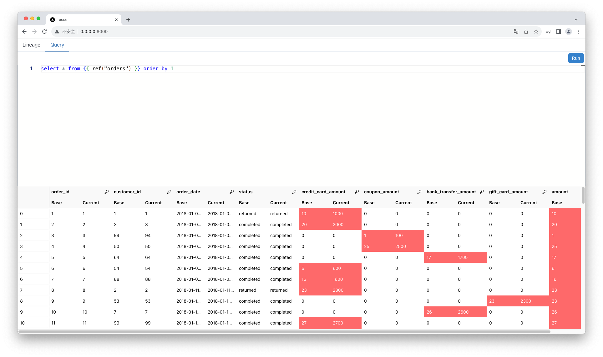

## Getting Started by Jaffle Shop

**Jaffle Shop** is an example project officially provided by dbt-labs. This document uses [jaffle_shop_duckdb](https://github.com/dbt-labs/jaffle_shop_duckdb) to enable you to start using **recce** locally from scratch within five minutes.

1. Clone the “Jaffle Shop” dbt data project

   ```bash
   git clone git@github.com:dbt-labs/jaffle_shop_duckdb.git
   cd jaffle_shop_duckdb
   ```

1. Prepare virtual env
   ```bash
   python -m venv venv
   source venv/bin/activate
   ```
1. Installation
   ```bash
   pip install -r requirements.txt
   pip install recce
   ```
1. Provide additional environment to compare. Edit `./profiles.yml` to add one more target.

   ```diff
   jaffle_shop:
       target: dev
       outputs:
       dev:
           type: duckdb
           path: 'jaffle_shop.duckdb'
           threads: 24
   +   prod:
   +     type: duckdb
   +     path: 'jaffle_shop.duckdb'
   +     schema: prod
   +     threads: 24
   ```

1. Prepare production environment

   ```bash
   dbt build --target prod
   dbt docs generate --target prod
   ```

   and copy the artifacts to `./target-base/`

   ```bash
   cp -R target/ target-base/
   ```

1. Prepare development environment. First, edit an existing model `./models/staging/stg_payments.sql`.

   ```diff
   ...

   renamed as (
            payment_method,

   -        -- `amount` is currently stored in cents, so we convert it to dollars
   -        amount / 100 as amount
   +        amount

            from source
   )
   ```

   run on development environment.

   ```bash
   dbt build
   dbt docs generate
   ```

1. Run the recce server

   ```bash
   recce server
   ```

   Open the link http://0.0.0.0:8000, you can see the lineage diff

   

1. Switch to the **Query** tab, run this query

   ```sql
   select * from {{ ref("orders") }} order by 1
   ```

   Click on the 🔑 icon next to the `order_id` column to compare records that are uniquely identified by their `order_id`.

   
